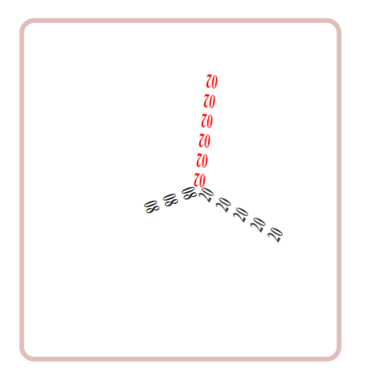

# Analog/Digital Clock Project
*This Analog-cum-Digital clock uses hands made up of time values to show the time in Digital format while also mimicking the visuals of an Analog by the hands of a clock constructed with digits corresponding to the current time.*  
 

★★★ Like this project? Leave a star, <a href="https://twitter.com/oijoshi">follow on Twitter</a>, or find me on <a href="https://www.linkedin.com/in/yashjosh/">LinkedIn</a>. Thanks! ★★★

 

> Definition of **'ronin'**  
> *a lordless samurai, esp one whose feudal lord had been deprived of his territory.* 
> **Etymology:** The word rōnin is usually translated to 'drifter' or 'wanderer'; It is an idiomatic expression for 'vagrant' or 'wandering man', someone who finds the way without belonging to one place. 
> The word is used to create an analogy for defining 'floating' things, which don't belong to a specific category of a certain thing or a certain type.

  "Experience the timeless beauty of this **Analog Clock** project. Written in HTML, CSS, and JavaScript, the clock showcases gracefully rotating hands with smooth transitions crafted from dynamically arranged digits. Watch as each second, minute, and hour unfolds seamlessly, framed within a stylish rounded border. The smooth movement and precise alignment create a visually captivating representation of time's perpetual dance."   

  

  

## Features
- **Dynamic Rotating Hands:** Each second, minute, and hour unfolds seamlessly with gracefully rotating hands.
- **Stylish Design:** The clock is framed within a rounded border, adding a touch of sophistication.
- **Smooth Movement:** The second hand exhibits smooth and continuous movement for a visually appealing experience.  

## Usage 
Simply open the HTML file in your web browser to witness the captivating display of time.   

Feel free to explore and customize the code to suit your preferences.  

Enjoy the elegance of time with this **Analog Clock** project! 

    You should [follow me on Twitter](https://twitter.com/oijoshi). Thanks for reading!
